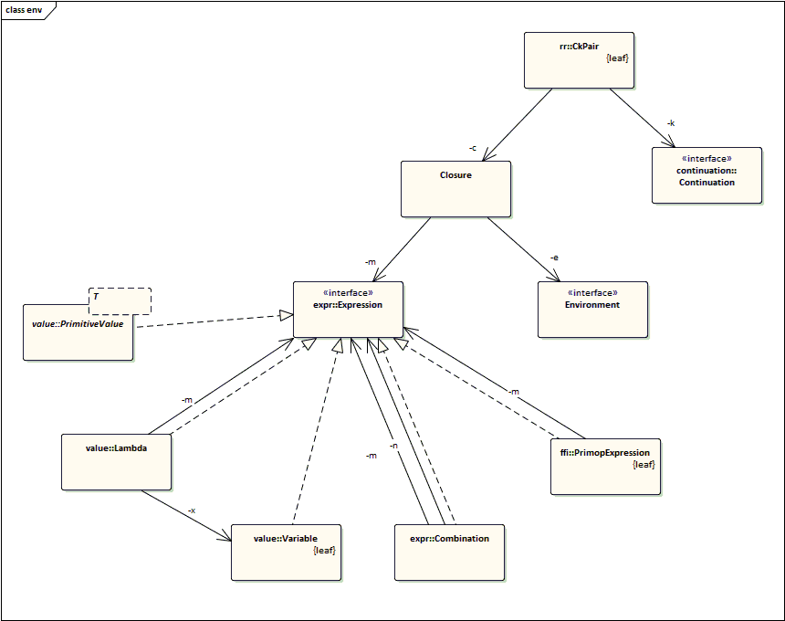
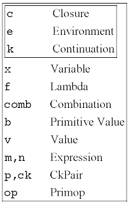
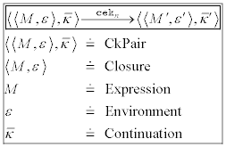
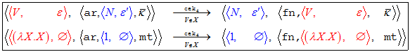
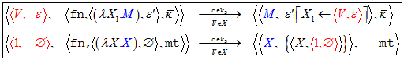
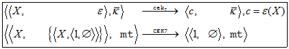
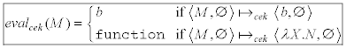
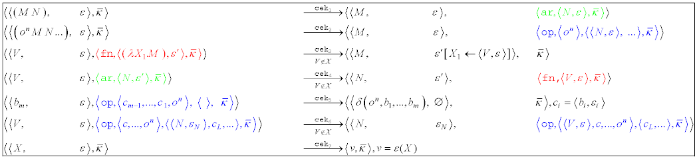
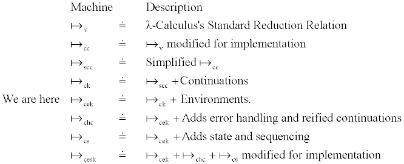

# The CEK Abstract Register Machine #

This passage from the preface of *Lisp in small pieces*[1] resonates with me in general, and I think it is applicable here.

> There are subjects treated here that can be appreciated only if you make an effort proportional
> to their innate difficulty. to harken back to something like the language of courtly love in
> medieval France, there are certain objects of our affection that reveal their beauty and charm
> only when we make a chivalrous but determined assault on their defenses; they remain impregnable
> if we don't lay siege to the fortress of their inherent complexity.

The development and proof of The CEK Machine is provided in [2].


## 1.1. Overview ##
My intent here is to describe the following class diagram in plain English.  *Italic* words are semantics engineering jargon and may have different meanings than you're familiar with.  Don't worry too much about the meaning of the words right now.

This machine reduces *expressions* to *primitive values*. An *expression* is evaluated within an *environment*. The *environment* is a list of *closures*. The *closure* is an *expression-environment pair*.  The definitions of *closure* and *environments* are mutually-recursive.

An expression can be a *variable*, a *lambda*, a *combination*, a *primitive value*, or a *primitive expression*.

The *continuation* tells the evaluator what to do next.  

The CkPair is a *closure-continuation* pairing.  The machine is defined as a set of reduction relations that transform CkPair instances into other CkPair instances.

## 1.2. Class Diagram ##



## 1.3. "Ident" Example ##

Here's an example of how a `CkPair` instance is created. In English first, then java. Java has variables, so does the CEK machine. I define a `Variable`  `"x"`, then define a `Lambda` function called `ident`; which simply returns its input.  Then I define a primitive `IntegerValue` of `1`.  A `Combination` is another way to talk about function application.  It means I'm applying the function `ident` to the argument `v`. E.g. if `ident(x) = x`, then `ident(1) = 1`.  The `Environment` is `NULL` because our expression is already complete, we don't need any additional `Variable` definitions.  I create a `Closure` with the `Combination` and `NULL` environment, and a `CkPair` with the `Closure` and `Continuation`.  The `MT` continuation is pronounced "empty".

```java
Variable       x = new Variable("x");

Lambda    ident = new Lambda(x, x);   
IntegerValue  v = new IntegerValue(1);
Expression    m = new Combination(ident, v);

Environment   e = Environment.NULL;
Closure       c = new Closure(m, e);
Continuation  k = Continuation.MT;
CkPair       ck = new CkPair(c, k);
```

## 1.4. Conventions ##

I use single letter variable names, but I'm consistent and there are a small number of them.  Here is a complete table of the variable naming conventions. Short variable names are important when you want a lot of content to fit in one page. They tie back to mathematical definitions of the CEK machine.



## 1.5. Code ##

Clone the repo, Run this example!!

fyi/jerry/cek/example/Identity.java

You should see something like this output on the command line:

```
((((L x x) 1) ()) mt)
=cek1=> (((L x x) ()) (ar (1 ()) mt))
=cek4=> ((1 ()) (fn ((L x x) ()) mt))
=cek3=> ((x ((x (1 ())) )) mt)
=cek7=> ((1 ()) mt)
```

Here it is again, this time I've manually formatted it to make it easier to see the component pieces.

```
        expression    environment   continuation
        ((((L x x) 1) ())           mt)
=cek1=> (((L x x)     ())           (ar (1 ())       mt))
=cek4=> ((1           ())           (fn ((L x x) ()) mt))
=cek3=> ((x           ((x (1 ())))) mt)
=cek7=> ((1           ())           mt)
```


The rest of the tutorial will step through the evaluation of the expression from the "ident" example. Only CEK1, CEK4, CEK3, and CEK7 are needed for this reduction.


## 1.6. Reduction Relations ##

A `ReductionRelation` performs a *single-step reduction*.  The set of `ReductionRelations` defined in The CEK Machine work in concert to continually perform a series of single-step reductions.  `ReductionRealtion` manipulates the tree structure defined by `CkPair` such that another `ReductionRelation` can do further processing.  At some point, the machine will halt with a result or become stuck.

Each `ReductionRelation` has a `.reducable()` method that it uses to perform case-analysis on a `CkPair` instance.  When the `.reducable()` method returns `true`, the machine applies the `.reduce()` method against the `CkPair`.  The same case-analysis is performed on the resultant `CkPair`.

I'll walk you through each step of the CEK machine as it evaluates the "ident" example. I'll show you a picture that has the reduction relation definition at the top. On the bottom will be that same reduction relation, but filled in with the example.  I've colored some of the terms to make it easier to see how the terms move around in the tree.

Here is how the mathematical expressions correlate to the java code.




### 1.6.1. Cek1 ###


*Top: Reduction relation as implemented in the java source code.  Bottom: The reduction relation filled in with our example expression.*

Cek1 reduces combination expressions.  Lets look at the M and N terms both before and after the reduction.


|**Term** | **Before Reduction**| **After Reduction**|
|---------|---------------------|--------------------|
| `M`       | `M` is in the function position of the `Combination` in the expression of the `CkPair`. | `M` is in the `Expression` position of the `CkPair`. |
| `N`       | `N` is in the argument position of the `Combination`.                   | `N` is pushed to the `Continuation` stack.         |


```java
final public class Cek1 implements ReductionRelation {

    @Override
    public boolean reducable(CkPair p) {
        return p.getC().getM() instanceof Combination;
    }

    @Override
    public CkPair reduce(CkPair p) {
        if(reducable(p)) {

            Closure      c = p.getC();
            Environment  e = c.getE();
            Continuation k = p.getK();

            Combination  combination = (Combination) c.getM();
            Expression   m = combination.getM();
            Expression   n = combination.getN();

            Closure        cm = new Closure(m, e);
            Closure        cn = new Closure(n, e);
            ArContinuation k1 = new ArContinuation(cn, k);
            CkPair         ck = new CkPair(cm, k1);

            return ck;

        } else {
            throw new IllegalStateException();
        }
    }

    @Override
    public String toString() {
        return "cek1";
    }
}
```

### 1.6.2. Cek4 ###



`Cek4` reduces `Value` expressions that have an argument continuation of type `ArContinuation`.  The `Closure` is pushed to the `Continuation` stack, and the `Closure` in the `ArContinuation` is moved to the `Expression` position of the `CkPair`.

```java
final public class Cek4 implements ReductionRelation {

    @Override
    public boolean reducable(CkPair p) {
        return       p.getC().getM() instanceof Value
                && !(p.getC().getM() instanceof Variable)
                &&   p.getK()        instanceof ArContinuation;
    }

    @Override
    public CkPair reduce(CkPair p) {
        if(reducable(p)) {

            Closure        c = p.getC();
            Environment    e = c.getE();
            ArContinuation k = (ArContinuation) p.getK();


            Environment    ek = k.getE();
            Continuation   kk = k.getK();
            Expression     nk = k.getN();

            Closure        c1 = new Closure(nk, ek);
            FnContinuation k1 = new FnContinuation(c, kk);
            CkPair         ck = new CkPair(c1, k1);

            return ck;

        } else {
            throw new IllegalStateException();
        }     
    }


    @Override
    public String toString() {
        return "cek4";
    }
}
```

### 1.6.3. Cek3 ###

 

`Cek3` reduces `value` expressions that aren't `Variable`s and have a function continuation of type `FnContinuation`.  In other words, `Cek3` evaluates the expression `M` in an extended `Environment`.  In the "ident" example, this means that the variable `x` is associated with the value 1.  This is a single step reduction though, so only one thing can happen at a time.  The evaluator cannot directly place the value 1 into the `Expression` position of the `CkPair`.

```java
final public class Cek3 implements ReductionRelation {

    @Override
    public boolean reducable(CkPair p) {
        return       p.getC().getM() instanceof Value
                && !(p.getC().getM() instanceof Variable)
                &&   p.getK()        instanceof FnContinuation
                && ((FnContinuation)p.getK()).getC().getM() instanceof Lambda;
    }

    @Override
    public CkPair reduce(CkPair p) {
        if(reducable(p)) {

            Closure        c = p.getC();
            Environment    e = c.getE();
            FnContinuation k = (FnContinuation) p.getK();

            Environment    ek = k.getC().getE();
            Continuation   kk = k.getK();
            Lambda         f  = (Lambda) k.getC().getM();
            Variable       x  = f.getX();
            Expression     m  = f.getM();

            Environment e1 = Environment.extend(ek, x, c);            

            Closure     cm = new Closure(m, e1);
            CkPair      ck = new CkPair(cm, kk);

            return ck;

        } else {
            throw new IllegalStateException();
        }

    }


    @Override
    public String toString() {
        return "cek3";
    }

}

```

### 1.6.4. Cek7 ###

 

Cek7 reduces variable expressions to a closure, or false if the variable isn't in the environment.

```java
final public class Cek7 implements ReductionRelation {

    @Override
    public boolean reducable(CkPair p) {
        return p.getC().getM() instanceof Variable;
    }

    @Override
    public CkPair reduce(CkPair p) {
        if(reducable(p)) {

            Closure      c = p.getC();
            Environment  e = c.getE();
            Continuation k = p.getK();

            Variable     x = (Variable) c.getM();

            Closure     c1 = e.lookup(x);
            CkPair      ck = new CkPair(c1, k);

            return ck;

        } else {
            throw new IllegalStateException();
        }
    }

}
```

This is where the machine stops! There is no way to reduce the ```CkPair``` returned by Cek7, so it is the result.

# Complete CEK Definition #


# Road-map #

# References #

[1]	C. Queinnec, LISP in small pieces. Cambridge England ; New York, NY, USA: Cambridge University Press, 1996, pp. xx, 514 p.

[2]	M. Felleisen, R. B. Findler, and M. Flatt, Semantics engineering with PLT Redex. Cambridge, Mass.: MIT Press, 2009, pp. xii, 502 p.

[3]	G. L. Steele and G. J. Sussman, Lambda : the ultimate imperative (AI memo no 353). Cambridge: Massachusetts Institute of Technology, Artificial Intelligence Laboratory, 1976, p. 39 p.

[4]	Pierce. (2016). Software Foundations. Available: http://www.cis.upenn.edu/~bcpierce/sf/current/index.html

[5]	H. Abelson, G. J. Sussman, and J. Sussman, Structure and interpretation of computer programs, 2nd ed. Cambridge, Mass.
New York: MIT Press ; McGraw-Hill, 1996, pp. xxiii, 657 p.
